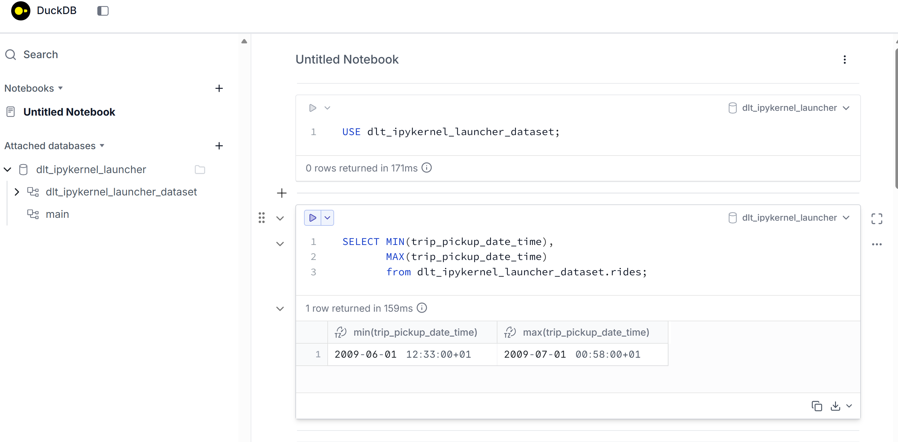

# DLT Homework Solution - DataTalkClub ZoomCamp

## Assignment Overview

The following image shows the assignment for this homework from the DataTalkClub ZoomCamp on Data Load Tool (DLT):



## Solution Approach

This homework involves creating a data pipeline using DLT to ingest data from a REST API. DLT (Data Load Tool) is a Python library that makes data loading simple and scalable. It automatically handles schema evolution, data normalization, and loading to various destinations.

### Key Requirements:
- Use DLT to create a pipeline
- Extract data from a REST API
- Load data to a destination (e.g., DuckDB, BigQuery)
- Handle incremental loading if applicable

## Implementation

### Step 1: Install Dependencies

First, ensure you have DLT installed:

```bash
pip install dlt
```

### Step 2: Create the Pipeline

Here's a sample DLT pipeline that loads GitHub repository data from the GitHub API:

```python
import dlt
import dlt
from dlt.sources.helpers.rest_client import RESTClient
from dlt.sources.helpers.rest_client.paginators import PageNumberPaginator


# Define the API resource for NYC taxi data
@dlt.resource(name="rides")   # <--- The name of the resource (will be used as the table name)
def ny_taxi():
    client = RESTClient(
        base_url="https://us-central1-dlthub-analytics.cloudfunctions.net",
        paginator=PageNumberPaginator(
            base_page=1,
            total_path=None
        )
    )

    for page in client.paginate("data_engineering_zoomcamp_api"):    # <--- API endpoint for retrieving taxi ride data
        yield page   # <--- yield data to manage memory


# define new dlt pipeline
pipeline = dlt.pipeline(destination="duckdb")


# run the pipeline with the new resource
load_info = pipeline.run(ny_taxi, write_disposition="replace")
print(load_info)


# explore loaded data
pipeline.dataset().rides.df()
```

### Step 3: Run and Verify

Execute the pipeline and check the loaded data:

```python
# Explore loaded data
import duckdb

conn = duckdb.connect("dlt_pipeline.duckdb")
result = conn.execute("SELECT * FROM rides LIMIT 5").fetchall()
print(result)
```

or You can go to the UI
```terminal
duckdb -ui dlt_pipeline.duckdb
```

## Additional Images

For reference, here are the other images in the folder for the solution:


## Conclusion

This solution demonstrates the basics of using DLT for data ingestion from REST APIs. DLT handles the complexities of data loading, allowing you to focus on the data extraction logic.